# LLMOps를 위한 프롬프트 엔지니어링 도구 개발 경험기

> **Source:** https://d2.naver.com/helloworld/3344073
> **Author:** 박슬기 | 네이버 Business Analytics
> **Date:** 2024.08.12
> **Views:** 11205

---

LLM  애플리케이션을 개발할 때 필요한 기본적인 구성 요소는 다음과 같습니다.


- 모델 또는 파인튜닝(fine-tuning) 체크포인트

- 온도(temperature), 반복 페널티(repetition penalty) 등의 하이퍼 파라미터

- 프롬프트(prompt)


이 글에서는 최적의 애플리케이션을 생성하기 위해 **구성 요소를 변경하고 평가하는 과정을 반복하는 경험**을 해보신 분들께 도움이 되고자, 네이버 Business Analytics 팀에서 프롬프트 엔지니어링 도구(prompt engineering tool)를 개발한 경험을 공유합니다.


## 개발 배경


올해 초부터 Business Analytics 팀은 LLM을 활용한 스펙을 개발하고 있는데 이 과정에서 **프롬프트 히스토리 관리에 어려움이 있었습니다.**


팀 내에서 3가지 스펙의 LLM 애플리케이션을 개발하면서 하나의 스펙에 적게는 1개에서 많게는 N개의 프롬프트를 사용했습니다. 프롬프트를 개발하고 최적화하면서 많은 수정이 발생해 프로젝트 저장소에 프롬프트가 버전별로 존재했고, 프롬프트를 변경하거나 추가할 때마다 새로 배포해야 했습니다.


또한 다양한 모델(오픈 소스 LLM, sLLM 등)과 파인튜닝 체크포인트를 고려해야 했고, 필요에 따라 온도 등의 파라미터 조절도 필요했습니다.


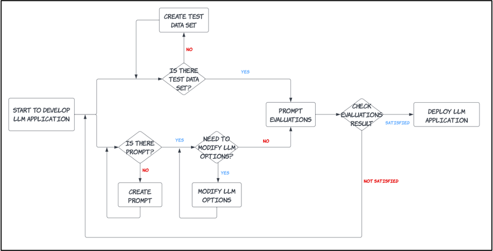


그러다 보니 하나의 LLM 애플리케이션을 개발하기 위해 다음과 같은 **반복적인 업무**를 진행해야 했습니다.


1. LLM 선택

2. 프롬프트 개발

3. 하이퍼 파라미터 수정

4. 평가를 위한 테스트 데이터 셋 생성

5. 평가 방식 선택

6. (1)~(3)으로 이루어진 결과물을 (4) 테스트 데이터 셋을 통해 (5) 방식으로 최종 평가


처음에는 다음과 같이 이슈에 프롬프트 수정 사항을 업데이트하면서 개발을 진행했습니다.


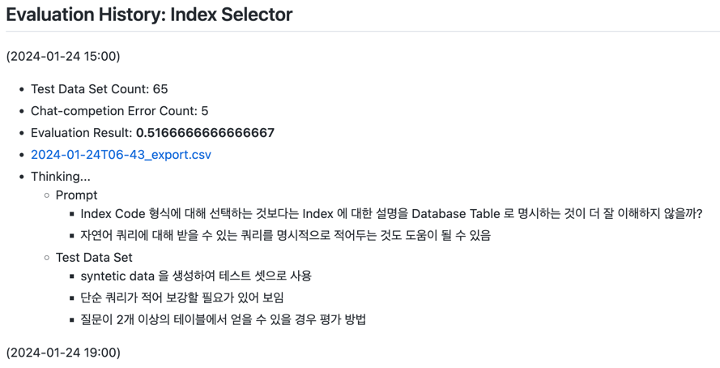


그런데 이 방법에는 다음과 같은 단점이 있었습니다.


- 이슈가 길어져 히스토리 파악이 힘들고, 테스트 데이터 셋과 평가 결과를 명확하게 한눈에 파악하기 힘들다.

- 평가 수치가 한눈에 보이지 않아 **의사 결정이 늦어지고 생산성이 떨어진다**는 느낌을 받는다.


그러다 보니 '**이런 고민을 해결해줄 수 있는 도구가 있을까?**'라는 생각이 들었습니다.


## 프롬프트 엔지니어링 도구란


이런 고민을 해결해주는 도구를 **프롬프트 엔지니어링 도구**라고 한다는 것을 알게 되어 다양한 오픈 소스를 검토해 보았습니다.


저희에게 필요한 기능은 다음과 같았습니다.


- 프롬프트 테스트

- 프롬프트 버저닝 및 배포

- 테스트 데이터 셋 관리 및 합성 테스트 데이터(synthetic test data) 생성 기능

- 평가


> **합성 테스트 데이터**
> 
> 
>   
>   초기에는 테스트 데이터 셋을 구축하기 힘들기 때문에 시드 문서를 기반으로 가상 데이터를 생성해 사용합니다(참고: [LangChain 문서](https://python.langchain.com/v0.1/docs/use_cases/data_generation/), [Ragas 문서](https://docs.ragas.io/en/latest/concepts/testset_generation.html)). 저희는 Q/A 쌍 생성에 사용했습니다.


검토한 오픈 소스는 다음과 같았습니다.


- [Agenta](https://github.com/Agenta-AI/agenta)

- [PromptTools](https://github.com/hegelai/prompttools)


검토 당시(2024년 2월)에는 각 도구에 미흡한 부분이 있어, 필요한 기능이 포함된 도구를 직접 개발하기로 결정했습니다(현재는 미흡했던 부분이 일부 개선된 것을 확인했으니 직접 개발하기 전에 오픈 소스를 검토하는 것을 권장합니다).


## 개발한 도구 소개


지금부터는 저희가 개발한 프롬프트 엔지니어링 도구의 기본 개념과 아키텍처를 소개합니다.


### 기본 개념


기본 개념은 다음과 같이 구상했습니다.


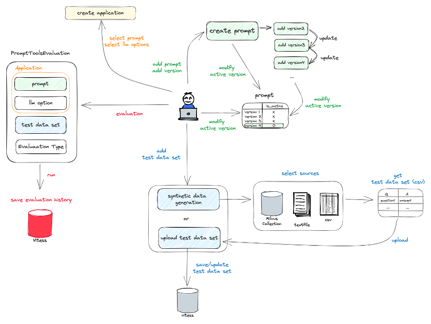


다음과 같이 나눠 하나씩 살펴보겠습니다.


- 프롬프트 버저닝 및 배포

- LLM 애플리케이션

- 테스트 데이터 셋

- 평가


#### 프롬프트 버저닝 및 배포, LLM 애플리케이션


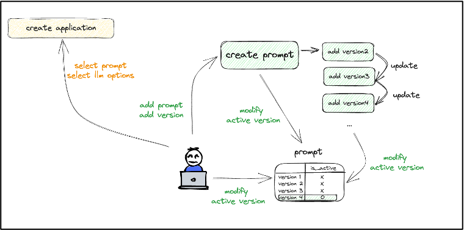


**프롬프트 버전**은  다음과 같이 정의했습니다.


- 하나의 프롬프트에는 **여러 개의 버전**이 있을 수 있다.

- 하나의 프롬프트에 **active 버전은 오직 1개**이다.


**애플리케이션**은 다음과 같이 정의했습니다.


- **애플리케이션**은 실제 LLM 애플리케이션의 단위이다.

- **애플리케이션 = 모델 + 프롬프트(active 버전) + LLM 옵션**


#### 테스트 데이터 셋


**합성 테스트 데이터**는 다음과 같이 정의했습니다.


- 시드 문서를 기반으로 Q/A 쌍을 가상으로 생성한다.

- 현재 Milvus Collection, 텍스트 파일, CSV 파일을 기반으로 생성이 가능하다.

- 생성된 가상 데이터 세트를 검토 및 수정하여 테스트 데이터 셋으로 업로드한다.


**테스트 데이터 셋 관리**는 다음과 같이 정의했습니다.


- 테스트 데이터 셋을 수정/삭제/추가한다.


#### 평가


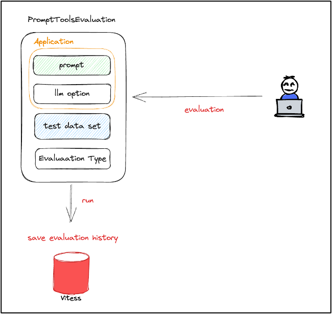


**평가**는 다음과 같이 정의했습니다.


- 동작할 애플리케이션(모델 + 프롬프트 + LLM 옵션)을 평가한다.

- 선택한 테스트 데이터 셋(Q/A) 기반으로 평가 지표를 생성한다.


현재 지원하는 **평가 유형**은 다음과 같으며 필요에 따라 계속 추가하고 있습니다.


- Exact Match String

- Embedding Distance

- [Ragas](https://docs.ragas.io/en/latest/references/metrics.html)에서 지원하는 일부 metric 포함

- RAGAS_FAITHFULNESS

- RAGAS_CONTEXT_PRECISION

- RAGAS_ANSWER_SEMANTIC_SIMILARITY

- [ARES](https://github.com/stanford-futuredata/ARES)에서 지원하는 일부 metric 포함(평가용 파인튜닝 LLM 생성)

- ARES_CONTEXT_RELEVANCE

- ARES_ANSWER_RELEVANCE

- ARES_ANSWER_FAITHFULNESS


### 아키텍처


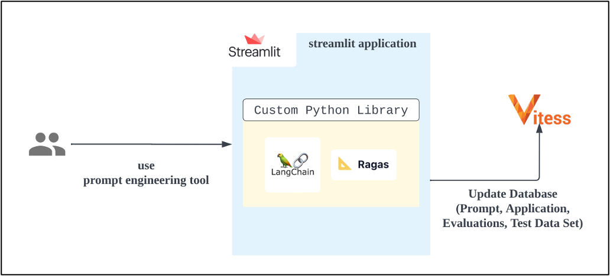


- Streamlit: 간편한 웹앱 생성

- Custom Python Library

- 해당 도구를 위한 다양한 기능 개발

- LangChain, Ragas 사용

- Vitess(MySQL): 전반적인 데이터 저장/관리

- 프롬프트

- 애플리케이션

- 테스트 데이터 셋

- 평가


## LLM 애플리케이션 개발 및 평가 과정


입력된 문장을 **긍정** 또는 **부정**으로 분류하는 애플리케이션을 예시로, LLM 애플리케이션을 개발하고 평가하는 과정을 살펴보겠습니다.


### 1. 프롬프트 생성


입력된 문장을 **긍정** 또는 **부정**으로 분류하는 프롬프트를 생성합니다.


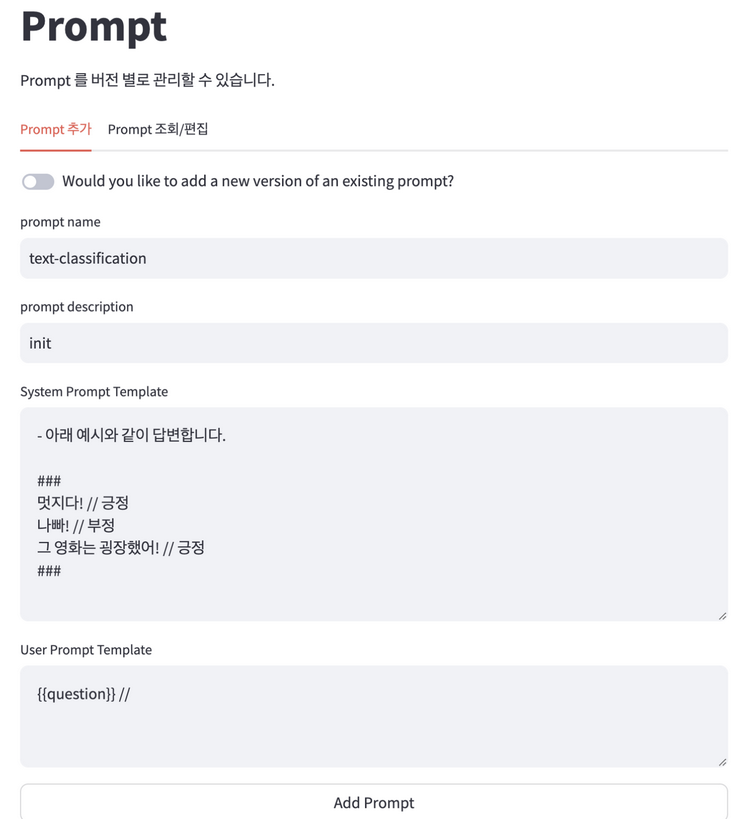


### 2. 테스트 및 적용


생성한 프롬프트를 선택하고, LLM 옵션이나 모델을 변경하면서 테스트합니다.


원하는 결과가 나왔다면 `save`를 클릭해 애플리케이션을 정의합니다.


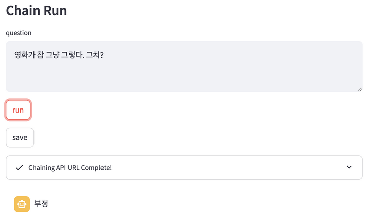


### 3. 프롬프트 버전 추가


기존에 입력된 프롬프트의 퓨샷(few-shot)을 제외하고, output indicator를 추가하여 조금 더 답변을 명시적으로 선언하고 싶습니다. text-classification을 선택하고, 새로운 버전의 프롬프트를 생성합니다.


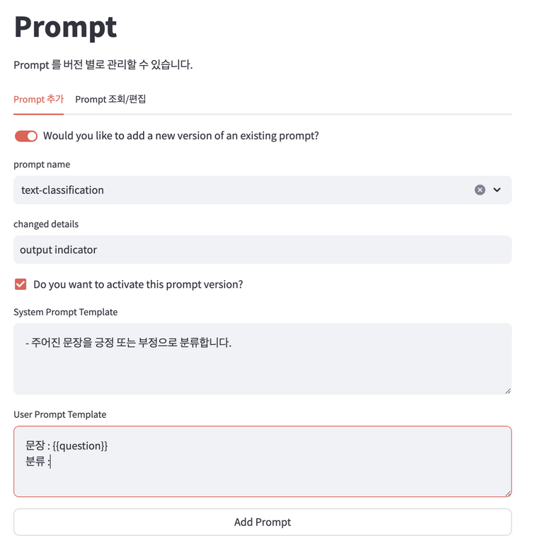


만약 처음 버전으로 돌아가고 싶다면, 원하는 버전의 `is_active` 칼럼을 활성화합니다.


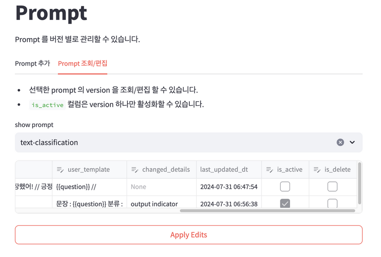


### 4. 테스트 데이터 셋 생성


LLM 애플리케이션 평가를 위해 5건의 문장을 분류하는 테스트 데이터 셋을 생성합니다.


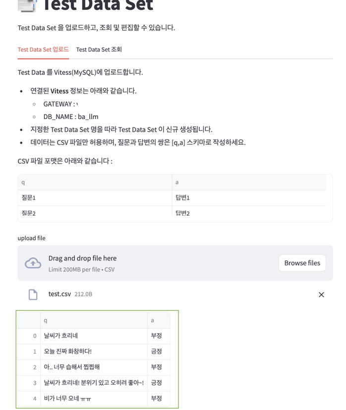


### 5. 평가


평가를 위해 다음과 같이 선택합니다.


- chain: 추가 데이터 전처리나 문서 검색 등이 필요 없으므로 (default)

- application: text-classification

- test_data_set: text_classification_data_set

- evaluator: EXACT_MATCH_STRING


최종 평가 결과는 `0.8`이며, 개별 결과도 확인할 수 있습니다. 해당 애플리케이션에서는 출력이 원하는 형식을 간혹 따르지 않는다는 것을 확인할 수 있습니다.


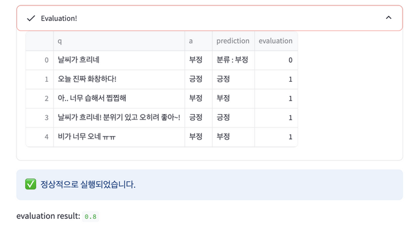


다음과 같이 과거 평가 이력을 확인할 수 있어, 프롬프트 변경 후 수치 비교가 가능합니다.


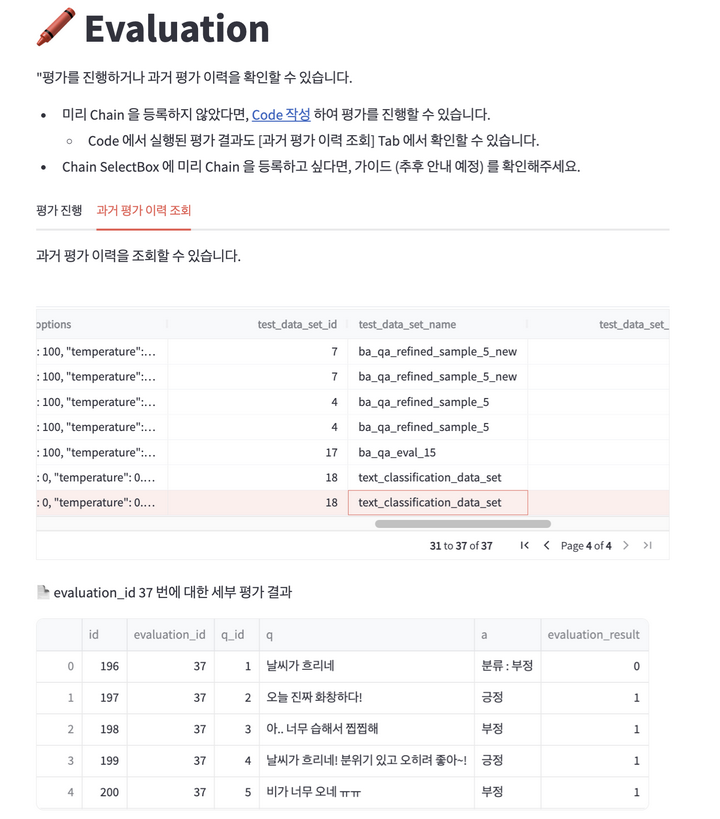


## 코드


프롬프트 엔지니어링 도구를 사용함으로써 프로젝트 내부의 LLM 애플리케이션 개발 코드가 훨씬 간단해졌습니다.


기존에는 다음과 같이 프로젝트에 여러 개의 프롬프트를 명시하는 코드를 포함해야 했습니다.


```
from langchain_core.prompts import (  
    ChatPromptTemplate,
    HumanMessagePromptTemplate,
    SystemMessagePromptTemplate
)

# OLD VERSION PROMPT
OLD_SYSTEM_PROMPT = """- 아래 예시와 같이 답변합니다.

###
멋지다! // 긍정
나빠! // 부정
그 영화는 굉장했어! // 긍정
###
"""
OLD_USER_PROMPT = """{{question}} //"""

# NEW VERSION PROMPT
SYSTEM_PROMPT = """- 주어진 문장을 긍정 또는 부정으로 분류합니다."""  
USER_PROMPT = """문장 : {{question}}  
분류 :"""

prompt = ChatPromptTemplate.from_messages(  
    [
        SystemMessagePromptTemplate.from_template(SYSTEM_PROMPT, template_format="jinja2"),
        HumanMessagePromptTemplate.from_template(USER_PROMPT, template_format="jinja2")
    ]
)

chain = chat_prompt_template | model | StrOutputParser()  
chain.invoke({"question": "오늘 날씨 참 별로네"})

# '부정'
```


저희가 개발한 프롬프트 엔지니어링 도구의 Python 라이브러리를 사용하면 다음과 같이 코드가 훨씬 간단하고 파악하기 쉬워집니다.


```
from llm_lib.prompttools.prompt import PromptToolsChatTemplate # custom library  
from langchain_core.output_parsers import StrOutputParser

prompt = PromptToolsChatTemplate("text-classification")  
chat_prompt_template = prompt.get_chat_template() # return ChatPromptTemplate

chain = chat_prompt_template | model | StrOutputParser()

# '부정'
```


또한 다음과 같은 이점이 있습니다.


- 하나의 프로젝트에서 여러 개의 프롬프트를 관리하기 용이함

- 프로젝트 내부에 프롬프트를 버전별로 생성할 필요가 없음

- 프로젝트 배포 없이 프롬프트 변경 가능


## 마치며


직접 개발한 프롬프트 엔지니어링 도구를 사용해본 결과 다음과 같은 장점이 있었습니다.


- UI 기반의 편리한 사용성으로 개발자뿐만 아니라 기획자도 사용 가능

- 프롬프트 버전별로 평가 지표 결과가 나아짐을 한눈에 확인할 수 있어 의사 결정이 빨라짐

- 테스트 환경이 Jupyter Notebook, Python 스크립트 등 분산된 환경에서 일원화

- 팀원들끼리 공유하기 위해 이슈 등을 따로 작성할 필요 없이 프롬프트나 평가 결과를 한눈에 파악 가능


향후 예정된 개선 사항은 다음과 같습니다.


- 테스트 데이터 셋을 유연하게 확장할 수 있도록 수정

- 프롬프트 버전별로 평가 결과를 피벗 테이블로 확인

- 다중 Chaining 지원


비슷한 고민을 하고 계신 분들께 도움이 되었길 바라며 글을 마무리합니다.


*개발에 도움을 주신 Business Analytics 성준혁 님, 조유정 님 감사합니다!*


